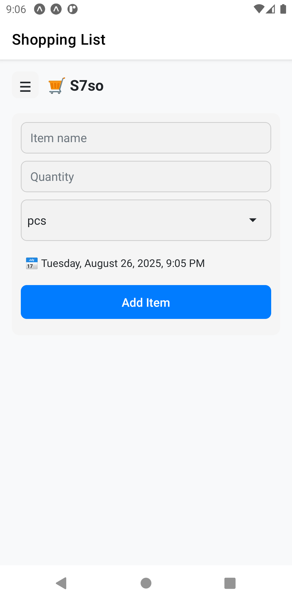
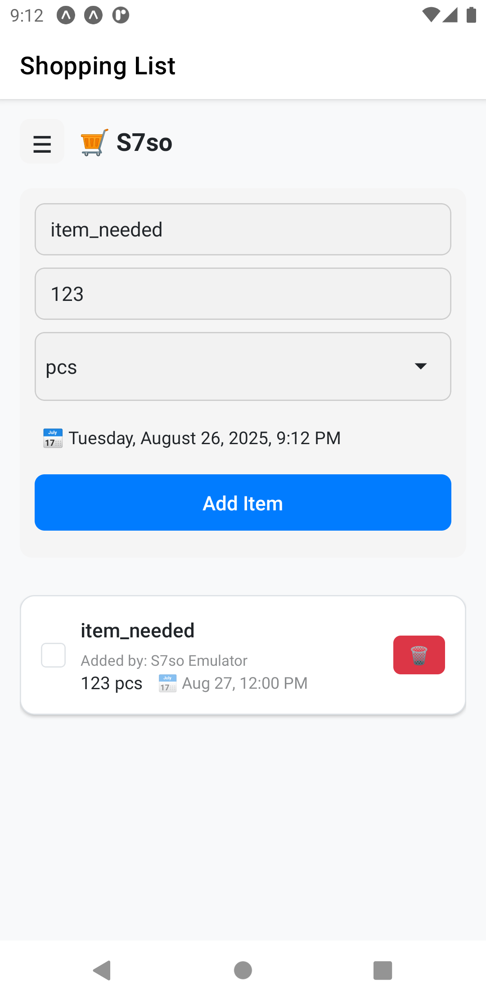
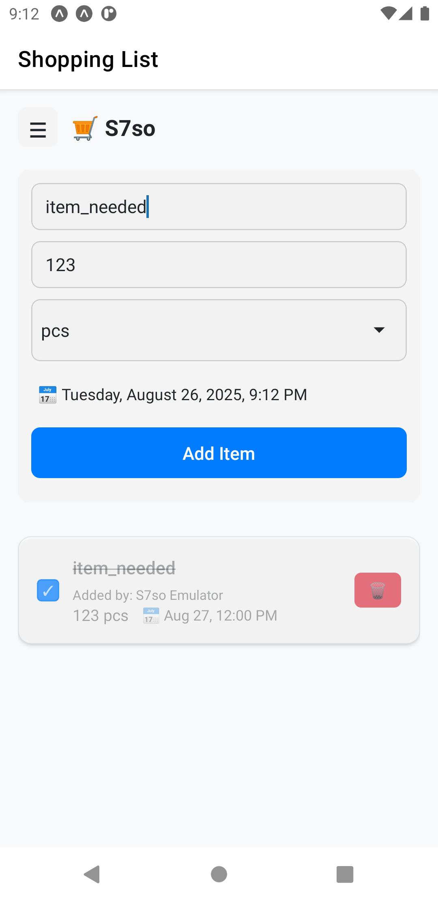
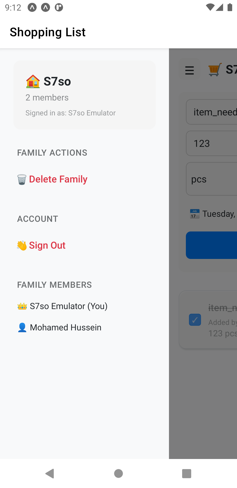

# Family Connect 👨‍👩‍👧‍👦

A **React Native + Expo** mobile app powered by **Firebase** that allows users to create, join, and manage families.  
It provides a secure way to share information between family members, manage access with passwords, and maintain privacy.

---

## 🚀 Features

- 📌 **Create Families** – Start a family group with a secure password and an owner account.  
- 👥 **Join Families** – Join existing families by providing the correct family ID and password.  
- 🔑 **Owner Controls** – Owners can manage members and are required to delete the family if leaving.  
- 🔒 **Authentication** – Firebase Authentication ensures secure access for all users.  
- ☁️ **Realtime Database & Firestore** – Keep family data synced across all members in real-time.  
- 📱 **Cross-Platform** – Built with Expo for both iOS and Android.  

---

## 📸 Screenshots

### 🏠 Home Screen


### ➕ Adding an Item


### ✅ Marked as Bought


### 👨‍👩‍👧 Family Menu



---

## 🛠️ Tech Stack

- [Expo](https://expo.dev/) – React Native framework  
- [Firebase](https://firebase.google.com/) – Auth, Firestore, Hosting  
---

## 📂 Project Structure

```
.
├── assets/             # Images, icons, etc.
├── app/layout.tsx      # Entry point
├── components/         # Shared UI components
├── contexts/           # Context providers
├── hooks/              # Custom React hooks
├── utils/              # Firebase config & helpers
│   └── firebaseConfig.ts   <-- 🔐 Must be created manually
└── ...
```

---

## 🔐 Firebase Config Setup

⚠️ The file `utils/firebaseConfig.ts` is **not included in the repo** for security reasons.  
You need to create it manually:

```ts
// utils/firebaseConfig.ts
import { initializeApp } from "firebase/app";

const firebaseConfig = {
  apiKey: "YOUR_API_KEY",
  authDomain: "YOUR_PROJECT_ID.firebaseapp.com",
  projectId: "YOUR_PROJECT_ID",
  storageBucket: "YOUR_PROJECT_ID.appspot.com",
  messagingSenderId: "YOUR_SENDER_ID",
  appId: "YOUR_APP_ID",
};

export const app = initializeApp(firebaseConfig);
```

👉 Replace with your Firebase project credentials.

---

## ▶️ Getting Started

1. Clone the repo:
   ```bash
   git clone https://github.com/Mohamed0Hussein/Talabat_ElBeit
   cd Talabat_ElBeit
   ```
2. Install dependencies:
   ```bash
   npm install
   ```
3. Create the `utils/firebaseConfig.ts` file as explained above.  
4. Run the app:
   ```bash
   npx expo start
   ```

---

## 🎯 Roadmap

- ✅ Basic family creation & joining  
- ✅ Firebase authentication  
- ⏳ Family chat & messaging  
- ⏳ Push notifications for updates  
- ⏳ Enhanced admin controls  

---

## 🤝 Contributing

Pull requests are welcome! If you’d like to add a feature or fix a bug, open an issue first to discuss.

---

## 📜 License

MIT License © 2025
